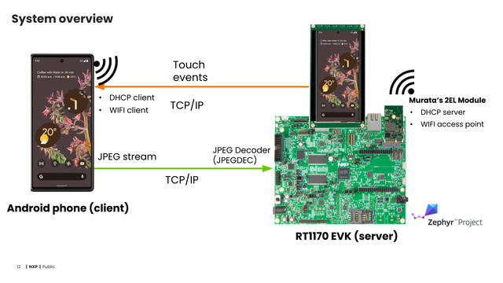
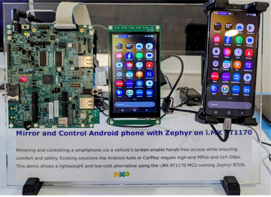

# NXP Application Code Hub
[](https://www.nxp.com)

## i.MX RT1170 Mirror and control android phone using Zephyr

This application demonstrates how to mirror and control an Android phone from an RT1170-EVKB running Zephyr. The Android screen is captured, encoded in MJPEG, and transmitted over Wi‑Fi or Ethernet to the RT1170-EVKB, where it is decoded and displayed on the LCD. The demo also supports touch input, allowing the user to control the phone directly from the RT1170’s touchscreen.

More details about the motivation and the implementation can be found [here](https://static.sched.com/hosted_files/osseu2025/c3/EOSS_2025_PhoneMirror_Final.pdf?_gl=1*1m0pnd4*_gcl_au*MTk3Mzc3ODk1Ni4xNzY2NTMwNTgx*FPAU*MTk3Mzc3ODk1Ni4xNzY2NTMwNTgx).



#### Boards: MIMXRT1170-EVKB
#### Categories: RTOS, ANDROID, Graphics, Touch Sensing
#### Peripherals: DISPLAY, I2C, VIDEO, Wi-Fi, ETHERNET
#### Toolchains: VS Code, GCC

## Table of Contents
1. [HW Requirements](#step1)
3. [Setup](#step2)
4. [Results](#step3)
5. [FAQs](#step4)
6. [Support](#step5)
7. [Release Notes](#step6)

## 1. HW Requirements<a name="step1"></a>

### 1.1 Required Components
- **[MIMXRT1170-EVKB](https://www.nxp.com/design/design-center/development-boards/i-mx-evaluation-and-development-boards/i-mx-rt1170-evaluation-kit:MIMXRT1170-EVK)** - i.MX RT1170 Evaluation Kit (Rev B)
- **[RK055HDMIPI4MA0](https://www.nxp.com/part/RK055HDMIPI4MA0)** - 5.5" MIPI LCD display panel with touchscreen
- **Android Smartphone** - A smartphone running Android 11 or later with USB debugging enabled. Google Pixel devices generally provide the best compatibility and performance. Samsung phones running recent versions of Android may experience issues, such as being unable to access the Internet during the demo.
- **USB Type-C Cable** - Used to connect the Android phone to the PC/laptop to push the Android app to the phone
- **Micro USB Cable** - Used to connect the Android phone to the PC/laptop for serial console output

### 1.2 Additional Components

#### Option A: Wi-Fi
- **[IW612-MURATA-2EL-M.2](https://www.nxp.com/products/wireless-connectivity/wi-fi-plus-bluetooth-plus-802-15-4/2-4-5-ghz-dual-band-1x1-wi-fi-6-802-11ax-plus-bluetooth-5-4-plus-802-15-4-tri-radio-solution:IW612)** - Wi-Fi 6 + Bluetooth 5.4 M.2 module

#### Option B: Ethernet
- **Ethernet Cable** - Standard RJ45 network cable (CAT7 or CAT5)
- **USB Type-C to Ethernet Adapter** - Note that adapter compatibility may vary between phone models. This demo has been validated with the BENFEI adapter and the UGREEN Revodok 7‑in‑1

## 2. Setup<a name="step2"></a>
### 2.1 HW Setup
- Attach the RK055HDMIPI4MA0 touchscreen to the RT1170-EVKB via the MIPI DSI connector (J48)
- If using Wifi, insert the IW612-MURATA-2EL-M.2 module into the M.2 slot (J23) of the RT1170-EVKB. If using Ethernet, connect the Android phone to the RT1170-EVKB via the USB-C to ethernet adapter and the Ethernet cable.
- Plug the power adapter to the RT1170-EVKB's power connector (J43).
- Connect the RT1170-EVKB to the PC via the micro-USB connector (J86) for serial console logs and for the debugging with LinkServer.

### 2.2 SW Setup
This demo consists of two applications: a Zephyr-based server running on the RT1170‑EVKB, and an Android client running on the phone. The two communicate using dedicated sockets for video streaming and control events.
The Android application is based on and **developed / adapted** from the open source [scrcpy](https://github.com/Genymobile/scrcpy) project. You can either use the prebuilt app included in android_app/ folder or build it yourself from the provided source code on **the android branch** in this same repository if the prebuilt does not work for you or in case you want to make some additional changes.

#### 2.2.1 Zephyr application

 - Install west tool and Zephyr SDK. If you are not familiar with Zephyr, follow this [guide](https://docs.zephyrproject.org/latest/develop/getting_started/index.html)
- Cloning the source code:

    ```bash
    west init my-workspace -m https://github.com/nxp-appcodehub/dm-i-mx-rt1170-android-phone-screen-mirroring --mr main
    cd my-workspace
    west update
    setup environment variables:
        Ubuntu Linux: source zephyr/zephyr-env.sh
        Windows: zephyr\zephyr-env.cmd
    west blobs fetch (to fetch nxp-hal, especially Wi-Fi, binary blobs)
    ```

 - Build the Zephyr application:
 
   - For Wi-Fi:

    ```bash
    west build -p -b mimxrt1170_evk@B/mimxrt1176/cm7 scrmirror/app -DOVERLAY_CONFIG=overlay-wifi.conf -DSHIELD='rk055hdmipi4ma0'
    ```

   - For Ethernet (you can use Enet100M as well because the required bandwidth is only ~11 Mbps):

    ```bash
    west build -p -b mimxrt1170_evk@B/mimxrt1176/cm7 scrmirror/app -DOVERLAY_CONFIG=overlay-ethernet.conf -DEXTRA_DTC_OVERLAY_FILE=~/my-workspace/zephyr/boards/nxp/mimxrt1170_evk/dts/nxp,enet1g.overlay -DSHIELD='rk055hdmipi4ma0'
    ```

   - For Ethernet over USB: this option can be used as well by enabling the USB-ECM functionality on J20 of the RT1170-EVKB using the build command below. Note that this connection mode is currently less stable than the normal Ethernet:

    ```bash
    west build -p -b mimxrt1170_evk@B/mimxrt1176/cm7 scrmirror/app -DOVERLAY_CONFIG=overlay-netusb.conf -DSHIELD='rk055hdmipi4ma0'
    ```

 - Flash the Zephyr application to the board:

    ```bash
    west flash (use linkserver by default)
    west flash --runner=jlink (or use jlink)
    ```

 - Reset the board by pressing the reset button or by power cycling it

#### 2.2.2 Android application
 - Install **adb** tool and optionally Android SDK if you want to rebuild the Android app. The easiest way is to install [Android Studio](https://developer.android.com/studio), which bundles all necessary tools—including the SDK, platform tools, and adb—so no additional setup is required.
 - Enable USB debugging mode on the phone.
 - Launch the prebuilt Android app by running the launch_android_app script.

    ```bash
    cd scrmirror/android_app/
    ./launch_android_app.sh
    ```
   **Note**: You will see some errors in the console which are expected as the phone is waiting to connect to the remote host

    ```
    [server] ERROR: Failed to connect to remote host, will retry
    java.net.SocketTimeoutException: failed to connect to /192.0.2.1 (port 5000) from /192.168.1.58 (port 41500) after 3000ms
    ```

 - Disable other Internet modes on the phone so that it could connect to the RT1170, e.g. mobile data (4G/5G) for Wi-Fi mode or mobile data and Wi-Fi for Ethernet mode.

 - Connect the phone to the RT1170-EVKB remote host:

   - **Wi-Fi:** Connect to the RT1170-EVKB access point with following credential:
      ```
      SSID: screen-mirror-wifi
      Password: nxpdemo2025
      ```
   - **Ethernet:** Plug the `USB Type-C Ethernet adapter` cable to the phone and the RT1170-EVKB to connect them via Ethernet.
   - **Ethernet over USB:** Connect the USB type C port of the phone to the USB J20 of RT1170-EVKB with a USB-C to micro-USB cable.
 - Once the RT1170 and the Android phone are connected, you can enable mobile data (4G/5G) and/or Wi-Fi to use Internet.

## 3. Results<a name="step3"></a>
How the demo look like:

[Demo video](https://www.youtube.com/watch?v=c6CALZsSDW8)



Expected console output on the Zephyr side:
```
[00:00:02.708,000] <inf> sd: Card does not support CMD8, assuming legacy card
[00:00:02.741,000] <inf> sd: Card switched to 1.8V signaling
STA MAC Address: 50:26:EF:B1:4A:FC
*** Booting Zephyr OS build v4.1.0-5028-gecdf66a55a78 ***
[00:00:04.697,000] <inf> main: Turning on AP Mode
[00:00:04.698,000] <inf> main: Protocol ua is selected

Display device: display-controller@40804000

Station connected: C6:8E:E7:C3:E6:3A
C6:8E:E7:C3:E6:3A C6:8E:E7:C3:E6:3A TCP: Waiting for client...
TCP: Accepted connection
[00:00:26.323,000] <inf> touch_report: Wait for control socket ...
[00:00:26.327,000] <inf> touch_report: TCP control socket is connected
[00:00:26.327,000] <inf> decode: Socket receiving started
[00:00:26.327,000] <inf> decode: Decoding thread started
```

## 4. FAQs<a name="step4"></a>

### Q1: How long does it take to establish the connection?
**A:** It takes a few seconds to establish the connection between the Android phone and the RT1170 board. Please be patient during the initial handshake process.

### Q2: Why isn't my Android phone connecting to the RT1170-EVKB?
**A:** You must temporarily disable other Internet modes (4G/5G and/or Wi-Fi) on your Android phone to connect it to the RT1170-EVKB. Once the connection is established, you can enable them again to have Internet.

### Q3: Why must I use `adb shell` as specified in the script to launch the application?
**A:** The Android application must be pushed and launched from an Android shell using `adb shell` to grant it the necessary privileged permissions to inject external touch events into the Android system. Without these permissions, the touchscreen control feature will not function.

### Q4: What should I do if the connection is lost or the system hangs?
**A:** If the demo encounters issues (e.g., system hang, connection loss), you need to repush and relaunch the Android app by running the launch_android_app.sh script and reconnect the phone to the RT1170-EVKB. If the issue persists, you could restart the RT1170-EVKB as well.

**Note:** While it's possible to implement automatic reconnection in the Android app, the proper solution would be for the Zephyr app to programmatically push, launch, and terminate the Android app via `adb` when the cable is connected/disconnected. However, since `adb` is not currently supported on MCU/Zephyr, manual intervention via a PC/laptop is required.

### Q5: How do I properly terminate the demo?
**A:** After completing the demo, you may manually kill the Android app to prevent battery drain. This can be done by either:
- Restarting your Android phone, **or**
- Killing it by executing the first part of the launch_android_app.sh script (comment out the rest)

### Q6: Can I use Wi-Fi and Ethernet simultaneously?
**A:** No, it's recommended to use only one connection method at a time for optimal performance and to avoid routing conflicts on the Android device.

### Q7: I cannot connect to the hotspot screen-mirror-demo, what should I do?
**A:** The Wi-Fi may have some problems after flashing the board. You can reset the board by pressing the reset button or by power cycling it.

### Q8: How can I contribute to the project?
**A:** More details regarding the design and implementation can be found in [EOSS 2025 presentation](https://osseu2025.sched.com/event/25VqU). There are several ways to improve performance and experience, such as supporting multi-core processing and porting ADB to Zephyr. Future work also includes adding new features like routing audio and camera frames to the phone to enable hands-free control. Contributions are welcome—please feel free to submit a PR if you would like to help implement any of these improvements.

## 5. Support<a name="step5"></a>

#### Project Metadata

<!----- Boards ----->
[]()

<!----- Categories ----->
[](https://mcuxpresso.nxp.com/appcodehub?category=rtos)
[](https://mcuxpresso.nxp.com/appcodehub?category=graphics)
[](https://mcuxpresso.nxp.com/appcodehub?category=touch_sensing)

<!----- Peripherals ----->
[](https://mcuxpresso.nxp.com/appcodehub?peripheral=display)
[](https://mcuxpresso.nxp.com/appcodehub?peripheral=i2c)
[](https://mcuxpresso.nxp.com/appcodehub?peripheral=video)
[](https://mcuxpresso.nxp.com/appcodehub?peripheral=wifi)

<!----- Toolchains ----->
[](https://mcuxpresso.nxp.com/appcodehub?toolchain=vscode)
[](https://mcuxpresso.nxp.com/appcodehub?toolchain=gcc)

Questions regarding the content/correctness of this example can be entered as Issues within this GitHub repository.

>**Warning**: For more general technical questions regarding NXP Microcontrollers and the difference in expected functionality, enter your questions on the [NXP Community Forum](https://community.nxp.com/)

[](https://www.youtube.com/NXP_Semiconductors)
[](https://www.linkedin.com/company/nxp-semiconductors)
[](https://www.facebook.com/nxpsemi/)
[](https://x.com/NXP)

## 6. Release Notes<a name="step6"></a>
| Version | Description / Update                           | Date                        |
|:-------:|------------------------------------------------|----------------------------:|
| 1.0     | Initial release on Application Code Hub        | February 6<sup>th</sup> 2026 |

## Licensing
Apache 2.0 License - See LICENSE file for details.

## Origin
This project use following open source projects:

[scrcpy](https://github.com/Genymobile/scrcpy) - Mirror and control Android devices on Linux, Windows, and macOS (Apache 2.0 License)

[JPEGDEC](https://github.com/bitbank2/JPEGDEC) - Optimized JPEG decoder library (Apache 2.0 License)
